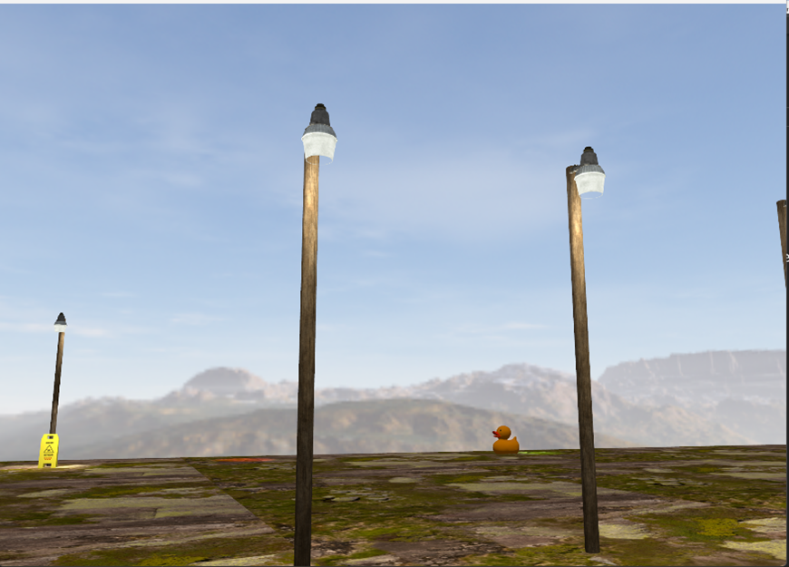
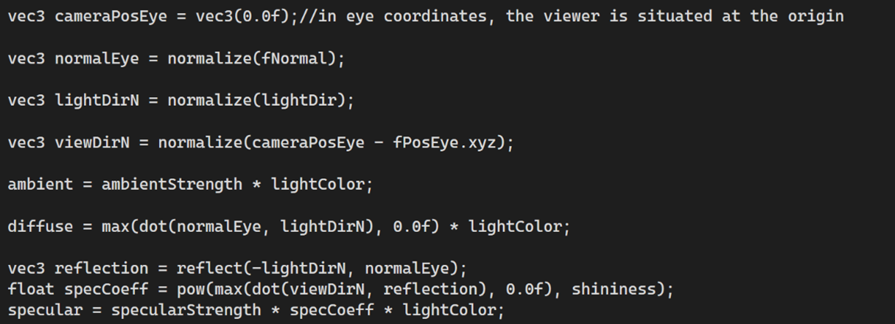

# OpenGL C++ photorealistic FPS scene
To illustrate how many can be done using OpenGL with little effort I have developed a scene with various functionalities and features.

## Scenario

### Scene and objects description
My scene does not particularly have a story behind it, but the objects are not randomly placed either. Some of them are connected, for example I have an old TV which acts like a CCTV camera and I have a CCTV camera on a pole.
 
To start from the beginning I have a cube which acts as the ground for the player to move on. There are 12 post lamps composed out of three objects:
<ul>
	<li>Pole</li>
	<li>Main light part</li>
	<li>Glowing part of the light</li>

</ul>
 

These lamps are the main light source during the night, but it can be easily seen they emit light during the day too.

 

There is also a 13th post lamp which also has a spotlight attached to it, besides its main pointlight, to illustrate the differences between them.
 

 

In the upper-right corner of the scene we have a fireplace which was custom made. I have downloaded models of logs and stones and placed each one of them manually. I have scaled and rotated them so it has a more natural look.

 

### Functionalities
First of all, the application is like a small First Person 3D game. The user/player can move in the scene using W, A, S and D for movement, it can also sprint and crouch.
 

 
Because we have night in the game, of course we need a flashlight which can also be toggled on or off.

 

What photorealistic scene is one without fog? The user can also toggle the fog or off. There are two types of fog, one for the day time and one for the night time, since the day time one needs a brighter color. We can see that the fog matches perfectly with the skybox’s blurred mountains and sun.

### Implementation details
#### Animations
The scene starts with an animation in which the majority of the scene is presented, like a cutscene in games. The user cannot interact with the application while the cutscene is running. For the animation I have implemented a state machine that changes between multiple keyframes of the animation. Between each two keyframes each animated object has one of its attributes modified by a function of this type:
 
**Object.attribute = glm::mix(value1, value2, elapsedTime);**
 

**elapsedTime**, which is the range of [0, 1] is incremented every frame with deltaTime\*speed where deltaTime is the time interval between two rendered frames. This way we can change the animation speed by changing the speed parameter.
 
When elapsedTime reaches 1, we move to the next animation state. For the first 2 animation states I do not only move and rotate the camera but also change the directional light intensity and change the skyboxes to make it feel like a full day-night cycle.
 
 
The lights from the fire are also animated to mimic a pulsating light from the fire, each of the properties having a different speed of looping to make them more natural.

 

There is also a small animation happening when the player moves. The camera moves a bit up and down to mimic a natural movement of a person. This extra movement is computed in the move function of the camera.

#### Collision detection
When the player is inside a square in the (x,z) plane in front of the TV and presses a button it switches the camera view to the CCTV camera. In this view mode he cannot move, or move the camera on the Y axis and also its sensitivity is reduced. Press that key again and get back to first person mode.

#### Lights
In the scene we have 3 different types of lights:
<ul>
	<li>Directional</li>
	<li>Point light</li>
	<li>Spotlight</li>

</ul>
The influence of the directional light on a fragment is calculated like this:

 
 
The normal of each fragment is computed based on camera’s position and the position of the fragment in eye space.
The influence of the point lights on the fragments is computed in the following way:
This computation is done for every point light in the scene. One major difference is that now we use the fragment’s position in the world space. For that we needed to modify a bit also the vertex shader to include this line:
 
**fragPos = (model \* vec4(vPosition, 1.0f)).xyz;**
 

 
**maxDistance** is used for efficiency purposes because by default all these operations are done by every fragment for every light, even if there influence in the texture components is almost 0.
 
**constant**, **linear** and **quadratic** are used in the computation of the attenuation component to mimic the light intensity dependency in real life.
 
**Intensity** is used to fine tune the light’s “power”. As I needed in many cases throughout the project a light which is dimmed on the edges but very powerful to the center.