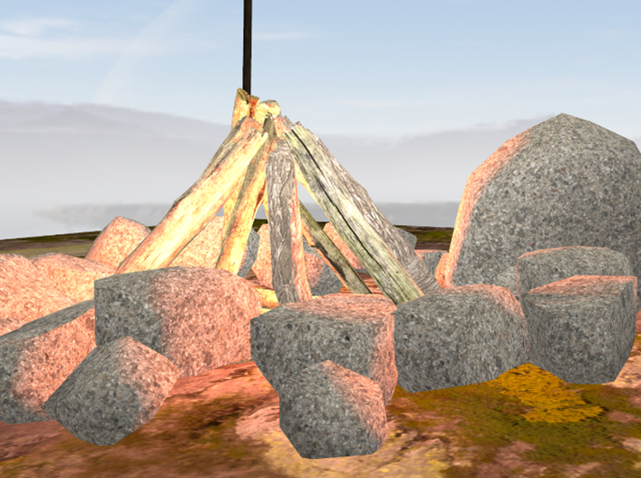

# OpenGL C++ photorealistic FPS scene
To illustrate how many can be done using OpenGL with little effort I have developed a scene with various functionalities and features.

## Scenario

### Scene and objects description
My scene does not particularly have a story behind it, but the objects are not randomly placed either. Some of them are connected, for example I have an old TV which acts like a CCTV camera and I have a CCTV camera on a pole.
 
To start from the beginning I have a cube which acts as the ground for the player to move on. There are 12 post lamps composed out of three objects:
<ul>
	<li>Pole</li>
	<li>Main light part</li>
	<li>Glowing part of the light</li>

</ul>
 

These lamps are the main light source during the night, but it can be easily seen they emit light during the day too.

 

There is also a 13th post lamp which also has a spotlight attached to it, besides its main pointlight, to illustrate the differences between them.

 

In the upper-right corner of the scene we have a fireplace which was custom made. I have downloaded models of logs and stones and placed each one of them manually. I have scaled and rotated them so it has a more natural look.
